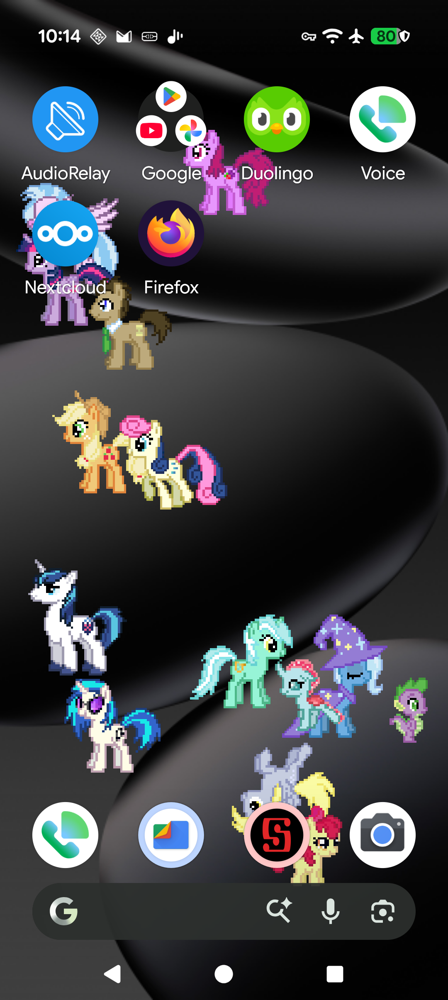
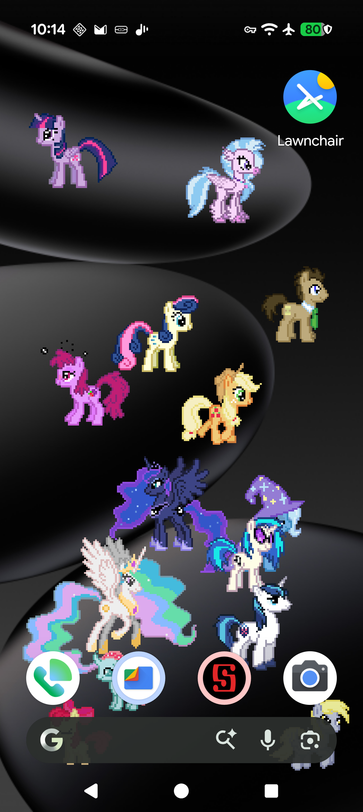
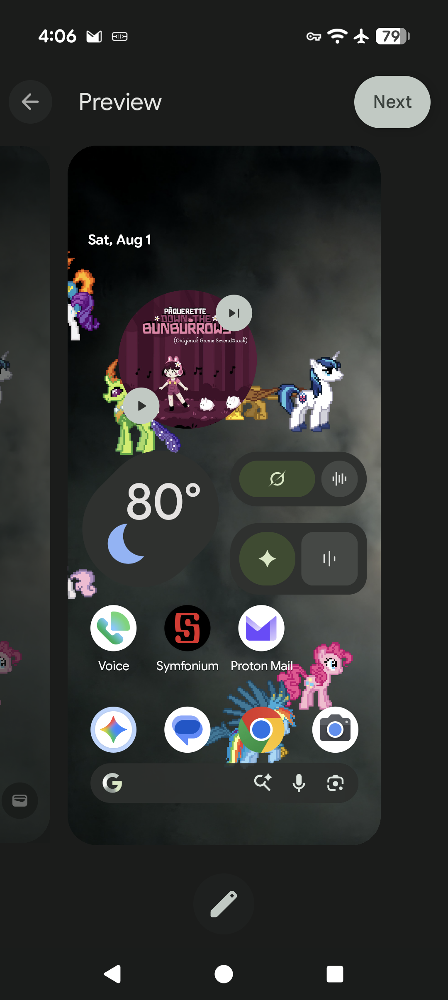
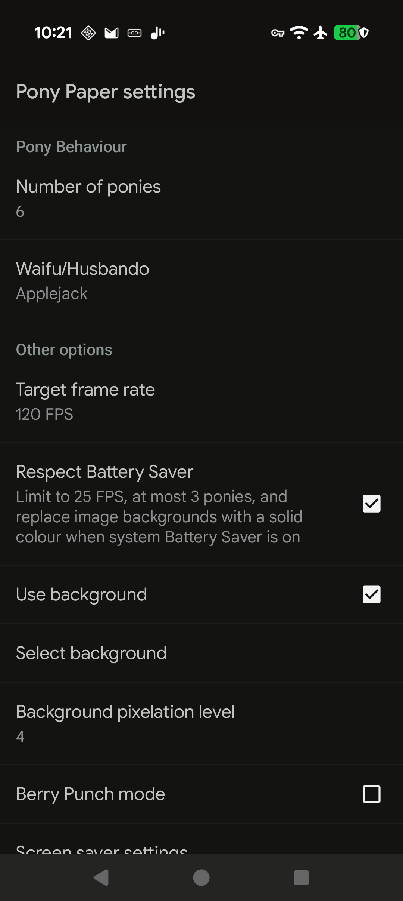
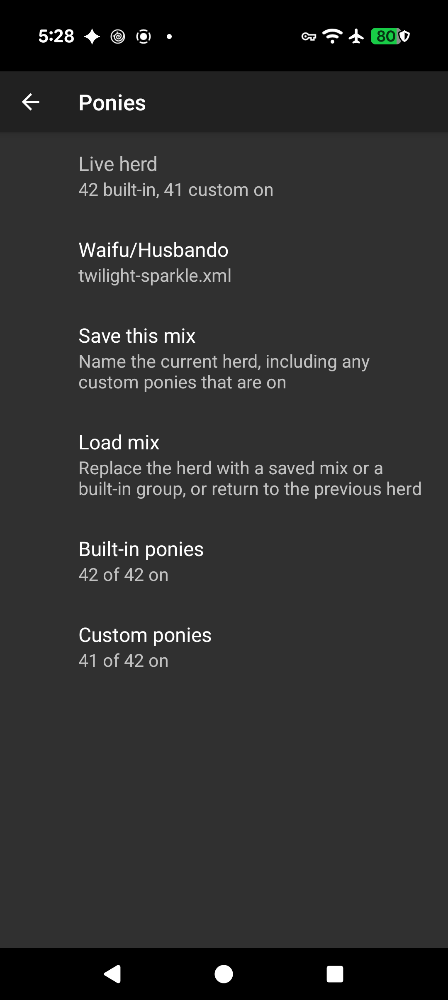
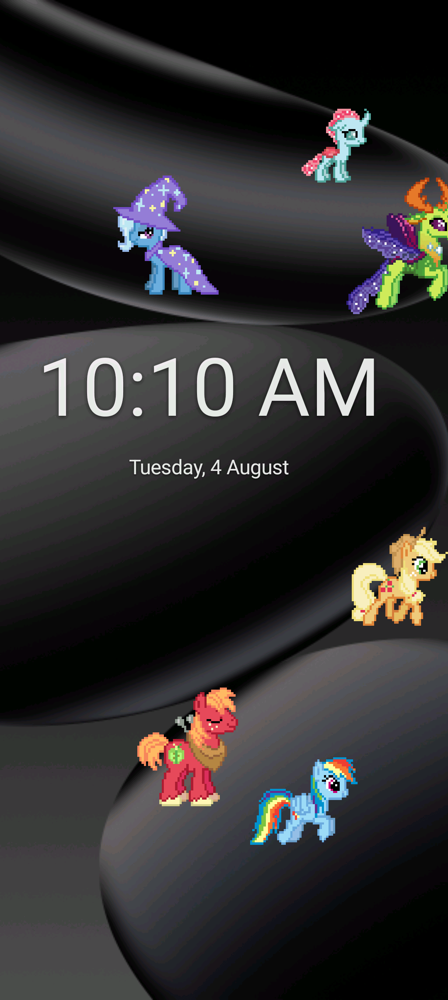
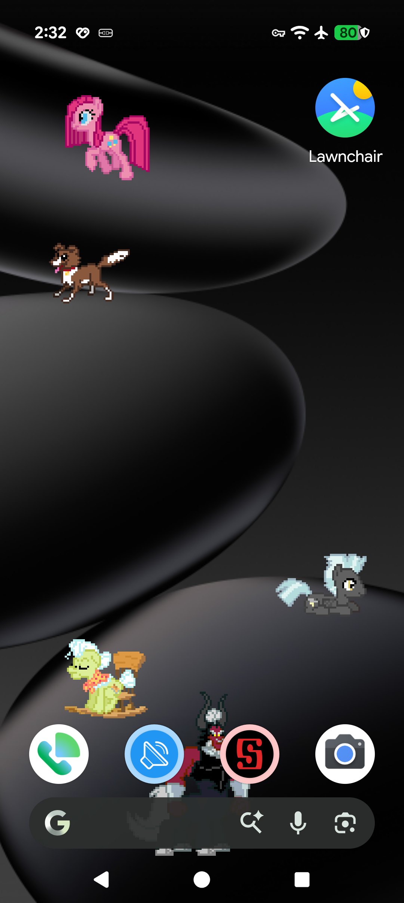

# PonyPaper (modern fork)

A live wallpaper for Android using pixel-art sprites of characters from *My Little Pony: Friendship is Magic*.

This repository is a **modernization fork** of the [Smithers888/PonyPaper](https://github.com/Smithers888/PonyPaper) project. Upstream Ant tooling and an ancient `targetSdk` no longer build or install cleanly on current Android. This fork targets a Gradle-based build and modern SDK levels so you can produce **debug/sideload APKs** without upstream signing keys.

### Features in this fork

- **Modern Gradle build** — builds and installs on current Android (minSdk 21); signed release APKs and editor JARs via GitHub/Gitea Actions
- **Installs alongside upstream** — application id `io.github.derram.ponypaper` (does not replace the original app)
- **Target frame rate** — prefer 30 / 60 / 90 / 120 FPS (default 60); motion is delta-time based so pony speed stays consistent
- **Battery Saver support** — optional respect for system Battery Saver (default on): cap at 25 FPS, at most 3 ponies, and solid-colour backgrounds instead of images
- **On-battery power profile** — optional prefs to force default FPS (30), default pony count (4), and/or disable image backgrounds while unplugged
- **Up to 14 ponies** on screen (11 wasn't loud enough)
- **Discrete gaits** — stroll, walk, and trot for more varied movement
- **Hold-to-drag** — press and hold a pony to drag it; no more accidentally jostling ponies when swiping the home screen
- **Import from Desktop Ponies** — updated custom character editor can import a folder from DP and build an xml file for use with PP
- **Optional screen saver** — wallpaper and screensaver can be enabled/disabled independently, uses the same herd and settings; enable under system Display settings. Idle timeout (default 10 minutes, or never) ends the saver after no touch so the display can sleep
- **Optional screensaver clock** — large digital clock, with optional date, drawn over the herd; 12/24-hour follows the system setting
- **Crash and stability fixes** — safer canvas handling, preference listener cleanup, hardened custom-pony import, sprite bitmap recycling
- **Custom pony library** — export/import a zip of custom ponies, the background, and saved mixes; optional user-owned folder (survives uninstall; reconnect once after reinstall)
- **Waifu selector** — best pony should always come first

        

## Install (from Releases)

Prebuilt APKs and the custom-pony editor JAR are published on the [Releases](https://github.com/derram/PonyPaper/releases) page. Prefer the latest release.

### Wallpaper (Android)

1. On your phone, open the release page in a browser and download the `.apk` (`PonyPaper-<version>.apk`).
2. Open the downloaded file (notification, Files app, or browser downloads).
3. If Android blocks the install, allow installs from that source when prompted (see [warnings below](#android-install-warnings)).
4. After install, set the wallpaper: long-press the home screen → **Wallpapers** → **Live wallpapers** → **Pony Paper**. Open settings from the wallpaper picker to toggle ponies, background, etc.
5. (Optional) Use as a **screen saver**: system **Settings → Display → Screen saver** (wording varies by OEM) → choose **Pony Paper**. From in-app settings you can also open **Screen saver settings**. The screensaver uses the same preferences as the wallpaper (ponies, FPS, background, etc.). Under **Screen saver** in-app you can optionally enable a large digital **clock** (and date), and set how long the saver stays on with no touch (**Turn off after inactivity**). On Pixel that defaults to 10 minutes. On other phones it stays **Never** until you pick a duration and allow lock, which is what actually powers the panel off; you can remove that permission later from the same Screen saver section.

### Custom pony editor (desktop)

1. From the same release, download `PonyPaper-CustomEditor-<version>.jar`.
2. Requires a desktop **Java 17+** runtime (Temurin, OpenJDK, etc.).
3. Run: `java -jar PonyPaper-CustomEditor-<version>.jar` (or double-click if your OS associates `.jar` with Java).
4. See [custom/README.md](custom/README.md) for sprites, actions, and how to load the resulting XML onto the device.

### Android install warnings

Sideloading (installing an APK outside the Play Store) is normal for open-source apps distributed via GitHub. Android will still warn you — that is expected, not a sign that this project is broken.

| What you may see | What it means | What to do |
|------------------|---------------|------------|
| **Blocked by Play Protect** / “harmful app” scan | Play Protect flags many apps that are not on Play, especially uncommon package names | Tap **More details** → **Install anyway** (or **Scan app** first if you prefer). You can also disable the block temporarily under Play Store → profile → Play Protect |
| **For your security, your phone is not allowed to install unknown apps from this source** | Installs from the browser / Files are off by default | Tap **Settings** on the dialog and enable **Allow from this source** for that app only |
| **Package installer** / “Do you want to install this application?” | Normal confirmation for any sideloaded APK | Review the app name, then **Install** |
| **App not installed** after an update | Usually a different signing key, or a downgrade to an older `versionCode` | Uninstall the existing Pony Paper from this fork, then install the new APK (wallpaper settings for this id will be cleared) |
| Browser “file may be harmful” | Generic download warning for `.apk` files | Keep the file if you trust this repository’s release |

**Trust checklist:** download only from this repo’s [Releases](https://github.com/derram/PonyPaper/releases) (not third-party mirrors), confirm the asset name and tag look right, and prefer HTTPS on github.com. This project is not distributed via Google Play, so Play Protect cannot “verify” the developer the way store apps are verified.

Requirements: Android **5.0+** (`minSdk 21`). Live wallpapers must be supported on the device (almost all phones; some locked-down or TV builds may hide them).

## Building

See [BUILDING.md](BUILDING.md) for debug builds, local signed releases, and the GitHub/Gitea release workflow.

## Original features

- Compatible in spirit with [Desktop Ponies](https://github.com/RoosterDragon/Desktop-Ponies), with a smaller pony set and fewer features.
- Enable/disable individual ponies; a few appear at once and rotate on/off screen.
- Optional custom ponies (see [custom/README.md](custom/README.md)). Export a zip backup from settings (custom ponies, background, and saved mixes), or choose a **Character library folder** so the herd survives uninstall.
- Optional background image, auto-pixellated to match the sprites.
- Drag ponies with touch (enabled in this fork).

## Licensing / credits

All artwork was created by contributors to the Desktop Ponies team ([DeviantArt](http://desktop-pony-team.deviantart.com/), [source](https://github.com/RoosterDragon/Desktop-Ponies)). Artwork and original source are licensed under [CC BY-NC-SA 3.0](http://creativecommons.org/licenses/by-nc-sa/3.0/).

Original Android source: [Smithers888](http://cpjsmith.uk) / [Smithers888/PonyPaper](https://github.com/Smithers888/PonyPaper).

You may share and modify this project under the same terms: credit, non-commercial use, and share-alike.
