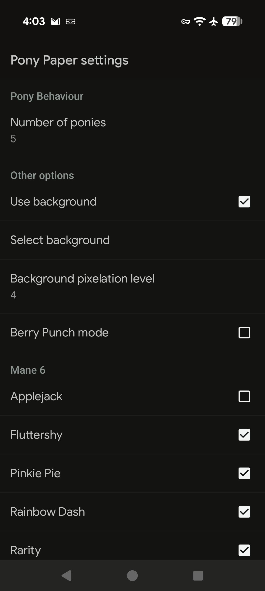

# PonyPaper (modern fork)

A live wallpaper for Android using pixel-art sprites of characters from *My Little Pony: Friendship is Magic*.

This repository is a **grok build modernization fork** of the [Smithers888/PonyPaper](https://github.com/Smithers888/PonyPaper) project. Upstream Ant tooling and an ancient `targetSdk` no longer build or install cleanly on current Android. This fork targets a Gradle-based build and modern SDK levels so you can produce **debug/sideload APKs** without upstream signing keys.

    

## Status

| Phase | Goal | Status |
|-------|------|--------|
| 1 | Gradle build, installable debug APK on modern devices | Done |
| 2 | AndroidX Preference settings, permission cleanup | Planned |
| 3 | Optional launcher/setup activity, store-ready packaging | Planned |

Original app version was **1.6.0** (`targetSdk 21`). This fork versions as **1.7.0-modern** (`minSdk 21`, `targetSdk 35`). Debug builds use application id `uk.cpjsmith.ponypaper.debug` so they can sit alongside an older install.

Debug APKs use the Android debug keystore automatically. For release builds, create your own keystore and wire it into `app/build.gradle.kts` (never commit the keystore or passwords).

## Build (debug)

Requirements:

- **Full JDK 17+** (not a JRE-only install — Android Gradle Plugin needs `jlink`)
- Android SDK with platform **35** and a recent build-tools package
- No release keystore needed for debug builds

```bash
# Point Gradle at your SDK (or copy local.properties.example)
echo "sdk.dir=$HOME/Android/Sdk" > local.properties

# If `java` is only a JRE, point Gradle at a full JDK, e.g.:
# echo 'org.gradle.java.home=/path/to/jdk-17' >> gradle.properties

./gradlew :app:assembleDebug
```

APK output:

```
app/build/outputs/apk/debug/app-debug.apk
```

Install on a device/emulator:

```bash
adb install -r app/build/outputs/apk/debug/app-debug.apk
```

Then set the wallpaper: long-press home screen → Wallpapers → Live wallpapers → **Pony Paper**. Open settings from the wallpaper picker to toggle ponies, background image, etc.

## Project layout

```
app/                 Android application module (Gradle)
  src/main/java/     Wallpaper + settings Java sources
  src/main/res/      Sprites, pony frame timings, preferences XML
custom/              Desktop custom-pony editor (unchanged, Ant/Java SE)
screenshots/         README images
```

The desktop editor under `custom/` is separate from the Android build.

## Original features

- Compatible in spirit with [Desktop Ponies](https://github.com/RoosterDragon/Desktop-Ponies), with a smaller pony set and fewer features.
- Enable/disable individual ponies; a few appear at once and rotate on/off screen.
- Optional custom ponies (see [custom/README.md](custom/README.md)).
- Optional background image, auto-pixellated to match the sprites.
- Drag ponies with touch (enabled in this fork).

## Licensing / credits

All artwork was created by contributors to the Desktop Ponies team ([DeviantArt](http://desktop-pony-team.deviantart.com/), [source](https://github.com/RoosterDragon/Desktop-Ponies)). Artwork and original source are licensed under [CC BY-NC-SA 3.0](http://creativecommons.org/licenses/by-nc-sa/3.0/).

Original Android source: [Smithers888](http://cpjsmith.uk) / [Smithers888/PonyPaper](https://github.com/Smithers888/PonyPaper).

You may share and modify this project under the same terms: credit, non-commercial use, and share-alike.
